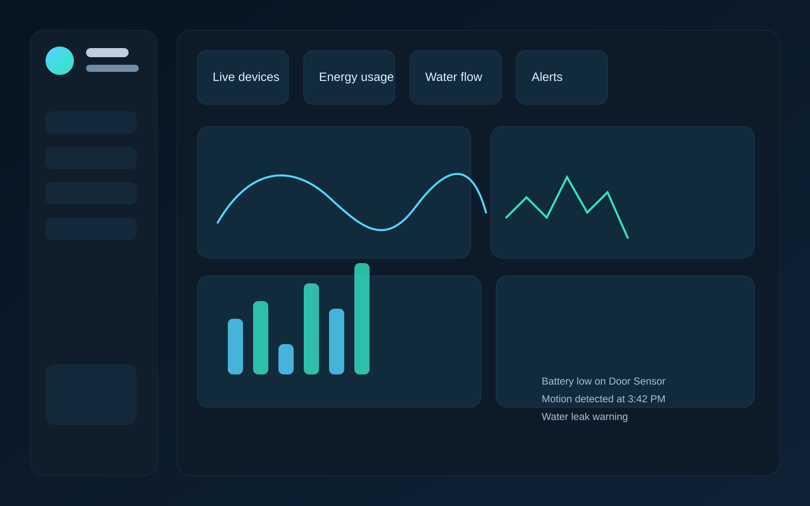

# Smart IoT Device Monitoring Dashboard

A polished, dark-themed smart home monitoring dashboard built with HTML, CSS, and vanilla JavaScript. It showcases connected devices, live metrics, energy usage charts, and alert notifications in a professional portfolio-ready layout.


## Live Demo

https://yourusername.github.io/smart-iot-dashboard/

## Screenshot



> Replace the placeholder artwork with a real screenshot before publishing the project to GitHub Pages.

## Features

- Real-time device status cards with online, warning, and offline states
- Live mock metric updates using JavaScript intervals
- Custom SVG-like chart rendering using HTML5 Canvas
- Responsive dark-mode dashboard layout
- Alert panel with dismiss actions
- Portfolio-ready presentation and clean semantic markup

## Tech Stack

- HTML5
- CSS3
- Vanilla JavaScript
- Google Fonts
- Responsive design principles

## Setup and Installation

1. Clone the repository:

   ```bash
   git clone https://github.com/yourusername/smart-iot-dashboard.git
   cd smart-iot-dashboard
   ```

2. Open the project in a browser:

   ```bash
   python -m http.server 8000
   ```

3. Visit the dashboard in your browser:

   ```text
   http://localhost:8000
   ```

## Folder Structure

```text
smart-iot-dashboard/
├── index.html
├── css/
│   └── style.css
├── js/
│   └── script.js
├── assets/
│   └── images/
├── .gitignore
├── README.md
└── LICENSE
```

## Author

Designed and developed by [Your Name](https://github.com/yourusername)

- GitHub: https://github.com/yourusername
- LinkedIn: https://www.linkedin.com/in/yourusername
- Email: your.email@example.com

## License

This project is licensed under the [MIT License](LICENSE).
